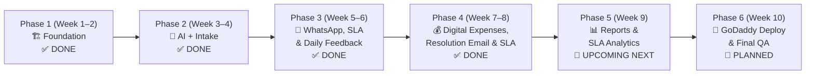

# 🛠️ COMPLAINT MANAGER — PROJECT ROADMAP & DEVELOPMENT STATUS
**Source of Truth:** [`complaint-manager-plan-v2.md`](file:///c:/Users/msi/Downloads/Engineers/complaint-manager-docs/complaint-manager-plan-v2.md) and [`complaint-manager-plan-final.md`](file:///c:/Users/msi/Downloads/Engineers/complaint-manager-plan-final.md)  
**Current Date:** September 2026 | **Application Status:** Active on `http://127.0.0.1:8000` | **Tests:** 51 Passed (221 Assertions)

---

## 📊 High-Level Timeline & Status Matrix

| Phase | Core Deliverables | Status | Test Coverage |
|---|---|---|---|
| **Phase 1: Foundation** | DB Schema, Roles (Admin, Superior, Engineer), Auth, Ticket CRUD, State Machine | ✅ **100% DONE** | Core Unit & Feature Tests |
| **Phase 2: AI & Ingest** | Gemini 3.1 Flash-Lite AI, Ingest Webhook, GoDaddy IMAP Webmail (`993/SSL`), Batch Auto-Triage | ✅ **100% DONE** | `Phase2Test.php` (11 tests, 53 assertions) |
| **Phase 3: WhatsApp, SLA & Feedback** | 1. WWebJS service, group screenshot alert tagging `@03XX`. 2. Threaded Bank Assignment Email reply (`In-Reply-To`). 3. Daily Progress Feedback timeline. 4. SLA Health countdown bar (Green, Amber, Red, Pulsing Breached). 5. `CheckSlaCommand` auto-escalation worker. 6. Regional Superior Escalations Command Center (`/tickets/escalations`). | ✅ **100% DONE** | `Phase3BAnd4Test.php` (8 tests) |
| **Phase 4: Engineer Workflow, Resolution Email & Digital Expenses** | 1. Streamlined Engineer Ticket table (hidden WhatsApp/Bank Email columns). 2. Live SLA Progress Bar & countdown directly on ticket tables. 3. Direct "Mark Complete" modal with Picture/PDF proof upload. 4. "Send to Workshop" modal with location & tracking. 5. Operations Manager table view (`Action`, `Assigned Engineer`, `Ticket #`, `Bank & Branch`, `Status`, `SLA Progress`). 6. Threaded Official Resolution Email dispatch to bank sender + CCs with attached resolution proof. 7. Ticket-specific Claim Expense modal with live upload progress bar (0% -> 100%) accepting Pictures and PDFs. 8. Strict claim audit policies (lock undo when claimed, single-active-claim rule). 9. Gemini AI highway distance benchmark calculation & Admin Bulk Payment / CSV export. | ✅ **100% DONE** | `EngineerTicketTableAndCompletionTest.php` & `Phase3BAnd4Test.php` (28 tests, 126 assertions) |
| **Phase 5: Reports & KPI Analytics** | Engineer Performance Scorecards, SLA Compliance Report, Scheduled Monday 7 AM Executive PDF, Chronic Machine tracking | 🚀 **UPCOMING NEXT** | Planned `Phase5Test.php` |
| **Phase 6: GoDaddy Production Deployment** | Production `.env`, cPanel Cron (`schedule:run`), MySQL VPS import, SSL, Final QA | 📅 Planned | Smoke / Deployment Audit |

---

## 🎯 Detailed Phase 4 Deliverables (Built & Verified)

### 1. Engineer Streamlined Ticket Management (`/tickets` & `/dashboard`)
* **Role-Tailored Column Layout:**
  - WhatsApp and Bank Email columns are automatically hidden when an Engineer logs in, keeping the table clean and focused purely on operational tasks.
* **Inline SLA Turnaround Progress Bar:**
  - Standardized Turnaround Time (TAT):
    - `critical`: 2 Hours
    - `high`: 4 Hours
    - `medium`: 8 Hours
    - `low`: 24 Hours
  - Displays dynamic gradient bar with color-coded SLA health status:
    - 🟢 **Healthy (>50% remaining):** Green progress track.
    - 🟡 **Warning (20%–50% remaining):** Amber track.
    - 🔴 **Critical (<20% remaining):** Red track.
    - 🚨 **Breached (≤0 min):** Pulsing red bar with overdue duration.
* **Quick Action Modals:**
  - **Mark as Complete:** Engineers can resolve tickets with an optional resolution summary and supporting document without being forced to enter daily feedback.
  - **Send to Workshop:** Opens an instant modal allowing engineers to specify workshop facility (e.g. Lahore Central Workshop) and handover notes. Status automatically advances to `awaiting_workshop`.
* **Supporting Document / Proof of Completion:**
  - Accepts both **Pictures (JPG, PNG, JPEG, WEBP)** and **PDF documents** up to 10MB.
  - Real-time progress bar, image preview thumbnail, or PDF document badge upon successful upload.

---

### 2. Operations Manager Command Center & Resolution Email Dispatch
* **Standardized Table Column Sequence:**
  - Table strictly orders: `Action`, `Assigned Engineer`, `Ticket #`, `Bank & Branch`, `Status`, `SLA Progress`, followed by fault details.
* **Official Threaded Resolution Email (`tickets.send-resolution-email`):**
  - Sends a direct reply to the bank's initiating complaint sender, retaining the original `In-Reply-To` and `References` email message headers for strict thread continuity.
  - **Preserves Original CC Recipients:** Automatically includes all email addresses previously copied on the bank ticket.
  - **Attaches Resolution Evidence:** Automatically attaches the engineer's uploaded completion picture or PDF handover document.
  - **Audit Tracking:** Displays an emerald status badge on the tickets table showing who dispatched the email (e.g. *Sent to bank@hbl.com by Operations Admin*) and timestamp.

---

### 3. Digital Expense Management & Live Voucher Upload
* **Contextual Triggering on `/tickets`:**
  - Generic "Submit Tour Expense Claim" button removed from `/expenses` index.
  - Claim Expense button appears specifically on the resolved ticket row on `/tickets`.
* **Interactive Upload Dropzone with Live Progress Bar:**
  - Accepts both **Pictures (JPG, PNG, JPEG, WEBP, GIF)** and **PDF documents** up to 10MB.
  - Live upload tracking (`XMLHttpRequest.upload.onprogress`) from `0%` to `100%`.
  - Automatically disables submission button during file upload to prevent incomplete transfers.
  - Transitions to **"Upload Done! Voucher Attached"** banner with filename, size, and visual thumbnail (images) or document badge (PDFs).
* **Gemini AI Distance & Benchmark Calculation:**
  - Computes highway driving distance between origin and branch city via Gemini AI (with local Pakistani matrix fallback).
  - Calculates suggested reimbursement benchmark at $\text{PKR 25/km}$.
* **Strict Anti-Tampering & Audit Policies:**
  - **Undo Lock:** Once a ticket is marked resolved and expenses are claimed, it cannot be undone.
  - **Single Active Claim Policy:** Only one expense claim can be active for a ticket at a time. A new claim is blocked until Operations Management reviews and rejects the current one.
  - **Re-submission Flow:** If rejected with admin audit notes, the claim enters `rejected` state and unlocks re-submission for the engineer.
* **Bulk Settlement & Financial Export:**
  - Multi-select batch disbursement with batch reference (e.g., `BATCH-2026-SEP-01`).
  - Single-click CSV export at `/expenses/export/csv`.

---

## 🗄️ Database Test Matrix (10 Seeded Scenario Tickets)

The database is seeded with 10 comprehensive operational tickets representing all active states:

| # | Ticket No | Bank & Branch | Urgency | Status | Assigned To | Key Feature Under Test |
|---|---|---|---|---|---|---|
| **1** | `CMP-2026-00101` | MCB Bank — Gulberg, LHR | High (4h) | `open` | Unassigned | Ingested via email, ready for Admin Assignment |
| **2** | `CMP-2026-00102` | HBL — Mall Road, LHR | Medium (8h) | `in_progress` | Ali Khan | 75% Healthy SLA; Ready for "Mark Complete" / "Send to Workshop" |
| **3** | `CMP-2026-00103` | UBL — Blue Area, ISB | Medium (8h) | `in_progress` | Hamza Ahmed | 37.5% Warning Amber SLA progress bar |
| **4** | `CMP-2026-00104` | Meezan Bank — Clifton, KHI | Critical (2h) | `in_progress` | Usman Tariq | 12.5% Critical Red SLA countdown bar |
| **5** | `CMP-2026-00105` | Allied Bank — Multan | High (4h) | `escalated` | Bilal Raza | SLA Breached (-6h, Pulsing Red); Escalated to Superior |
| **6** | `CMP-2026-00106` | Standard Chartered — Gulberg | Medium (8h) | `resolved` | Ali Khan | Resolved with Image proof; Ready for "Claim Expense" (Progress Bar) & "Send Resolution Email" |
| **7** | `CMP-2026-00107` | Bank Alfalah — Sahiwal | Medium (8h) | `resolved` | Ali Khan | Active Claim Submitted (PKR 8,500, PDF voucher); Locked Undo & Single-Claim Policy; Ready for Admin Audit |
| **8** | `CMP-2026-00108` | Faysal Bank — Gujranwala | High (4h) | `awaiting_workshop` | Ali Khan | Machine dispatched to Lahore Central Workshop |
| **9** | `CMP-2026-00109` | Askari Bank — Rawalpindi | Medium (8h) | `resolved` | Hamza Ahmed | Resolved with PDF proof; Resolution Email already sent (Emerald badge visible) |
| **10** | `CMP-2026-00110` | Bank of Punjab — Faisalabad | Medium (8h) | `resolved` | Ali Khan | Expense Claim Rejected with reason; Re-submission unlocked |

---

## 🚀 Upcoming Next Step: Phase 5 (Reports & Executive Analytics)

When ready to proceed, **Phase 5** will deliver:
1. **Executive Performance Dashboard (`/reports`):**
   - MTTR (Mean Time to Resolution) by Bank and Urgency.
   - First-Time Fix Rate (%) per Field Engineer.
   - Bank-by-bank SLA compliance metrics.
2. **Automated Monday 7:00 AM Executive PDF Report:**
   - Background Artisan worker `reports:generate-weekly-pdf`.
   - Generates and emails an executive summary PDF with branded styling and SLA charts.
3. **Chronic Machine Tracking:**
   - Automatically flags ATM/CDM machines logging $\ge 3$ complaints within a rolling 30-day window.
   - Alerts Operations Managers to initiate root-cause hardware replacement or workshop overhaul.
4. **Engineer Mileage & Expense Audit Summary:**
   - Monthly audit ledger comparing claimed travel funds against Gemini AI highway benchmarks.

---

## 📌 Reference User Logins for Testing

* **Operations Admin:** `admin@banksupport.com` (or `ops@banksupport.com`) / `password`
* **Regional Superior:** `supervisor@banksupport.com` / `password`
* **Field Engineers:**
  - `ali@banksupport.com` (Lahore) / `password`
  - `usman@banksupport.com` (Karachi) / `password`
  - `hamza@banksupport.com` (Islamabad) / `password`
  - `bilal@banksupport.com` (Multan) / `password`
